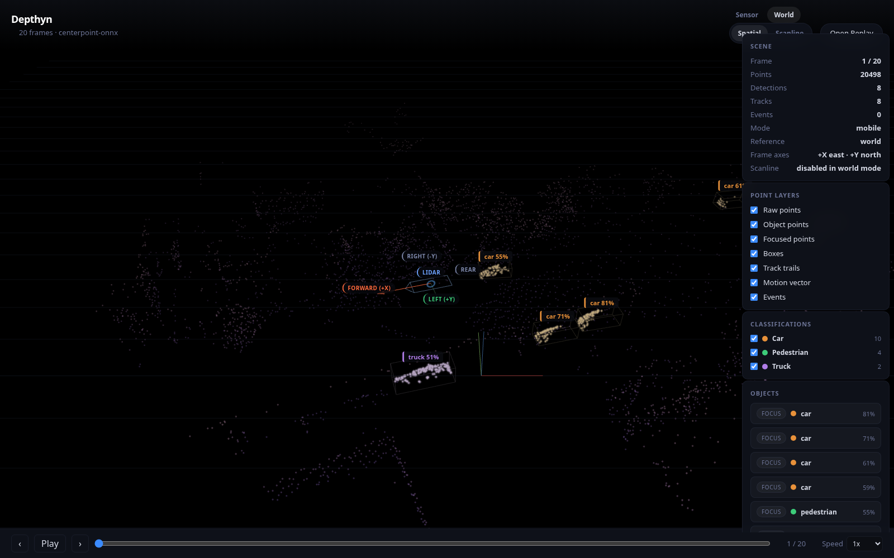
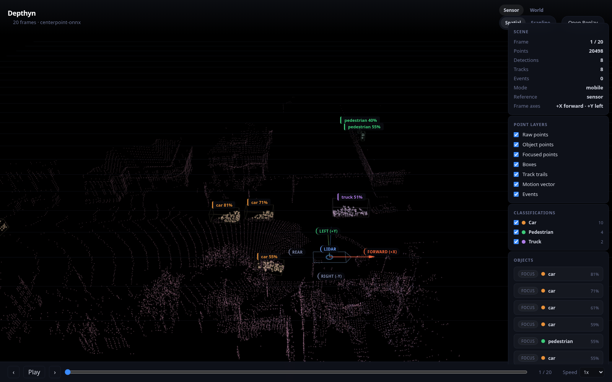

# Depthyn

3D tracking and scene intelligence from LiDAR.

Depthyn is an open source LiDAR perception platform for two workflows:
- live sensor operation
- recorded replay and analysis

The repo is organized around the product architecture, not around any one
ML framework. Detection backends are pluggable. Replay, tracking, zones,
alerts, scene state, and visualization are the stable core.

## Product Architecture

```text
LiDAR source
  -> input adapter (CSV, pcap, live UDP)
  -> unified frame contract
  -> preprocessing
  -> detector backend
  -> tracking
  -> scene intelligence
  -> replay bundle / API / UI
```

Source adapters:
- **Converted CSV** — replay from `lidar-rpi-gps-pipeline` exports
- **Ouster pcap** — replay raw Ouster sensor captures via `ouster-sdk`
- Planned: live Ouster UDP, OSF replay

Detector backends can change without rewriting the rest of the stack:

```text
preprocessed frame
  -> baseline clustering detector
  -> optional ML detector backend (ONNX CenterPoint, etc.)
  -> normalized detections
  -> tracks, zones, alerts, viewer
```

## Current Capabilities

- Replay converted CSV frames or raw Ouster pcap captures
- Auto-detect source type (CSV vs pcap) from input directory
- Support `mobile` and `stationary` processing modes
- Downsample and filter LiDAR frames
- Run a non-ML baseline using clustering + tracking
- Run ONNX CenterPoint inference with GPU acceleration (car, truck, bus, pedestrian, bicycle)
- Emit product-facing scene state per frame
- Evaluate XY zone rules with enter, dwell, and exit events
- Write replay bundles for downstream API/UI work
- Serve 3D and 2D browser viewers for recorded sessions
- World-align mobile replay using GPS pose interpolation
- Carry both sensor-frame and GPS/world-frame views in one replay bundle
- Compare the baseline against optional ML detector backends
- Browse replay events with jump-to-frame workflow in the 3D viewer

## Quick Start

### Replay from raw Ouster pcap

```bash
PYTHONPATH=src python3 -m depthyn.cli replay \
  SampleData/26 \
  --detector centerpoint-onnx \
  --output artifacts/pcap-centerpoint.json \
  --max-frames 20
```

### Replay from converted CSV

```bash
PYTHONPATH=src python3 -m depthyn.cli replay \
  SampleData/output-26/converted_csv \
  --output artifacts/sampledata-26-summary.json \
  --mode mobile \
  --max-frames 20
```

### View results in 3D

```bash
PYTHONPATH=src python3 -m depthyn.cli serve-viewer \
  --summary artifacts/pcap-centerpoint.json
```

Then open the printed 3D viewer URL in a browser.

### Mobile replay in a GPS-aligned world frame

Use this for moving-vehicle sessions when the input directory contains one
matching `raw_gps_*.csv` file or when you pass `--gps-path` explicitly:

```bash
source .miniforge3/etc/profile.d/conda.sh
conda activate depthyn-mmdet3d
PYTHONPATH=src python -m depthyn.cli replay \
  artifacts/session-inputs/20260317_094022 \
  --source-type pcap \
  --detector centerpoint-onnx \
  --mode mobile \
  --world-align \
  --preview-points 200 \
  --output artifacts/3-17-20260317_094022-centerpoint-world.json
```

Then open it in the viewer:

```bash
PYTHONPATH=src python3 -m depthyn.cli serve-viewer \
  --summary artifacts/3-17-20260317_094022-centerpoint-world.json
```

Notes:
- detector inference still runs in the sensor frame
- the replay bundle now preserves both:
  - `Sensor` view for LiDAR-native inspection
  - `World` view for GPS-aligned route context
- the viewer lets you toggle `Sensor / World` without regenerating the replay
- world replay currently uses GPS XY position and heading; raw GPS altitude is intentionally ignored to avoid noisy vertical jitter
- `Scanline` is an optional sensor-native inspection mode. It is most useful for debugging what the LiDAR saw in one instant, not for route playback or map context.

### Sensor vs World in the viewer

Depthyn supports two complementary views from the same GPS-aligned replay bundle:

- `Sensor`
  - ego marker and axes stay at the LiDAR origin
  - best for object inspection and LiDAR-native rendering
  - the only mode where `Scanline` is enabled
- `World`
  - points, detections, tracks, and ego pose are GPS-aligned
  - best for understanding the vehicle path and spatial context
  - `Scanline` is disabled here because it is a sensor-image view, not a world-map view

If you only need the classic sensor-local replay, omit `--world-align` and the bundle will contain only the `Sensor` view.

### Replay with zone rules

```bash
PYTHONPATH=src python3 -m depthyn.cli replay \
  SampleData/output-26/converted_csv \
  --output artifacts/sampledata-26-zones.json \
  --mode mobile \
  --max-frames 20 \
  --zone-config examples/zones/sample-yard.json
```

When a replay contains zone-driven scene events, the 3D viewer now shows:
- an `Events` panel with jump-to-frame actions
- event markers on the playback scrubber
- track-focused review when you jump from an event
- event summary chips by type
- more natural event wording like `Car crossed West Gate westbound`

### Replay with tripwires and exportable events

```bash
source .miniforge3/etc/profile.d/conda.sh
conda activate depthyn-mmdet3d
PYTHONPATH=src python -m depthyn.cli replay \
  artifacts/session-inputs/20260317_094022 \
  --source-type pcap \
  --detector centerpoint-onnx \
  --mode mobile \
  --world-align \
  --max-frames 40 \
  --preview-points 5000 \
  --detail-points 14000 \
  --zone-config examples/zones/3-17-094022-demo.json \
  --output artifacts/3-17-20260317_094022-centerpoint-dual-40f-rules.json
```

That demo config now includes both:
- rectangular zones for `entered` / `dwell` / `exited`
- directed tripwires for `crossed`

In the 3D viewer, the `Events` panel also supports:
- filtering by event type, class, and rule name
- exporting the filtered event list as `JSON` or `CSV`

Tripwire direction labels follow the configured directed segment:
- `start_xy -> end_xy` defines the tripwire orientation
- `positive_direction_label` is emitted when the crossing motion follows the segment's right-hand normal
- `negative_direction_label` is emitted for the opposite crossing direction

### Author zones and tripwires in the viewer

The 3D viewer now includes a `Rules` panel for replay-first authoring:
- `Add Zone`
  - click two ground-plane corners in `Spatial`
- `Add Tripwire`
  - click a start point and an end point in `Spatial`
- `Import Rules`
  - load a JSON rules file into the active `Sensor` or `World` rule set
- edit rule fields in the sidebar
- drag zone corners and tripwire endpoints directly in the scene
- export the current reference frame's rules as JSON
- save/load rules through the local viewer service
- `Apply Rules`
  - re-evaluates the current replay in-memory using the authored rules
- `Reset Preview`
  - restores the original replay events from disk without reloading the file

Important behavior:
- authoring is reference-frame aware
  - `World` authoring is for GPS/world-aligned rule placement
  - `Sensor` authoring is for sensor-local rule placement
- `Scanline` is not an authoring mode
- exported rule JSON is scoped to the currently selected reference frame
- replay preview is also reference-frame aware
  - applying rules in `World` re-evaluates world-frame tracks
  - switching to `Sensor` can apply that frame's authored rules instead

The local viewer service now exposes a small session API while `serve-viewer` is running:
- `GET /api/session`
- `GET /api/rules?frame=sensor|world`
- `PUT /api/rules?frame=sensor|world`

That service powers the in-viewer `Save Rules` / `Load Saved` workflow for a local app session.
It is still a local app architecture, not a cloud dependency.

### Evaluate against Gemini/Ouster logs

```bash
PYTHONPATH=src python3 -m depthyn.cli evaluate \
  "SampleData/Scooter LiDAR Experiment 1/Scooter LiDAR Experiment 1" \
  --gt-log "SampleData/Scooter LiDAR Experiment 1/Scooter LiDAR Experiment 1/object_list+occupations+aggregation_timeseries.log" \
  --detector centerpoint-onnx \
  --mode stationary \
  --output artifacts/evaluation-scooter.json
```

For stationary scenes, you can also force ML inference to run on
foreground-only points after background suppression:

```bash
PYTHONPATH=src python3 -m depthyn.cli evaluate \
  "SampleData/Scooter LiDAR Experiment 1/Scooter LiDAR Experiment 1" \
  --gt-log "SampleData/Scooter LiDAR Experiment 1/Scooter LiDAR Experiment 1/object_list+occupations+aggregation_timeseries.log" \
  --detector centerpoint-onnx \
  --mode stationary \
  --detector-on-foreground \
  --output artifacts/evaluation-scooter-foreground.json
```

## ONNX CenterPoint

Depthyn includes an in-process ONNX CenterPoint detector using Autoware v2
PointPillars models. No MMDetection3D installation required.

Download the models:

```bash
python3 tools/download_models.py
```

Run with CenterPoint:

```bash
PYTHONPATH=src python3 -m depthyn.cli replay \
  SampleData/26 \
  --detector centerpoint-onnx \
  --output artifacts/centerpoint-results.json \
  --max-frames 30
```

Classes detected: car, truck, bus, pedestrian, bicycle.

Requirements: `numpy`, `onnxruntime-gpu` (or `onnxruntime` for CPU).

## 3D Viewer

WebGL-based 3D point cloud viewer built with Three.js:

- Height-colored point cloud rendering
- Sensor-native LiDAR ring rendering for richer sensor-frame inspection
- Wireframe bounding boxes with per-class colors and heading rotation
- Floating labels with class name and confidence score
- Track trails showing movement history
- Ego marker with forward arrow, plus moving GPS-aligned pose in world replay mode
- `Sensor / World` toggle when the replay bundle includes GPS-aligned data
- `Spatial / Scanline` toggle, with `Scanline` scoped to sensor view
- Event list with jump-to-frame workflow for zone/dwell replay review
- Timeline event markers on the playback scrubber
- Orbit/pan/zoom controls with ground grid
- Frame playback with slider, speed control, keyboard shortcuts (Space, Arrow keys)
- Dark theme UI

The viewer loads the same replay JSON produced by the `replay` command.

### Viewer Screenshots

World view with GPS-aligned route context:



Sensor view for LiDAR-native inspection:



## Ouster Pcap Source

Read raw Ouster pcap captures directly without CSV conversion:

```bash
PYTHONPATH=src python3 -m depthyn.cli replay \
  SampleData/26 \
  --detector baseline \
  --max-frames 10
```

Source type is auto-detected from file extensions. Override with `--source-type pcap` or `--source-type csv`.

Requirements: `ouster-sdk`, `numpy`.

## ML Replay Workflow

Depthyn supports a model-host-agnostic workflow for recorded-data ML evaluation:

1. Export filtered replay frames in ML-friendly `XYZI` binary format
2. Run any external detector against those exported frames
3. Import the normalized detections back into Depthyn
4. Compare them against the built-in baseline on the same replay

Export a replay bundle for ML runners:

```bash
PYTHONPATH=src python3 -m depthyn.cli prepare-ml-replay \
  SampleData/output-26/converted_csv \
  --output-dir artifacts/ml-replay \
  --max-frames 20
```

Compare baseline vs imported ML detections:

```bash
PYTHONPATH=src python3 -m depthyn.cli compare \
  SampleData/output-26/converted_csv \
  --output-dir artifacts/detector-comparison \
  --detectors baseline precomputed \
  --precomputed-path /path/to/predictions
```

Prediction input formats:
- a directory of per-frame JSON files named `<frame_id>.json`
- a single JSON file containing frame-to-detections mappings

Each detection entry should include:
- `centroid`
- `bbox_min`
- `bbox_max`

Optional fields:
- `detection_id`
- `label`
- `score`
- `heading_rad`
- `point_count`
- `cell_count`

## Replay Output

Each frame summary includes:
- preview points
- detections
- active tracks
- `scene_state` with tracked objects
- zone occupancy
- zone events

Top-level replay bundles also include:
- scene bounds
- playback timing
- zone definitions
- tripwire definitions
- aggregate metrics
- event summaries

That structure is intended to become the basis for future REST/WebSocket APIs.

## Detector Backends

Built in:
- `baseline`: clustering + tracking (no ML required)
- `centerpoint-onnx`: ONNX CenterPoint with PointPillars voxelization (GPU or CPU)
- `precomputed`: imported normalized detections from any external model runner

Optional (require MMDetection3D):
- `centerpoint`
- `dsvt`
- `pointpillars`

Manual ML backend setup lives in [docs/mmdet3d_setup.md](docs/mmdet3d_setup.md).

## Repository Layout

- `src/depthyn/source/`: input adapters (CSV, Ouster pcap)
- `src/depthyn/perception/`: preprocessing and baseline perception
- `src/depthyn/detectors/`: pluggable detector backends
- `src/depthyn/tracking/`: track management
- `src/depthyn/scene/`: scene-state contracts
- `src/depthyn/rules/`: zone rules, tripwires, and event generation
- `viewer/`: browser replay UI (3D and 2D viewers)
- `tools/`: model download and utility scripts
- `docs/`: architecture and setup notes
- `tests/`: unit tests
